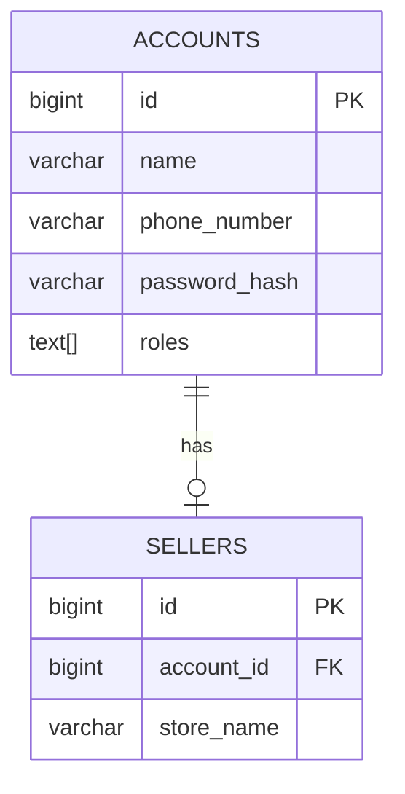

# Design Document: Seller Module

## Overview

The Seller module is a bounded context responsible for managing seller profiles in the yadwy marketplace platform. It follows Domain-Driven Design (DDD) tactical patterns and integrates with the identity module through event-driven communication using Spring's `ApplicationEventPublisher`.

The module reacts to `AccountCreatedEvent` from the identity module to automatically provision seller profiles when accounts with the SELLER role are registered. This ensures loose coupling between modules while maintaining data consistency.

## Architecture

```mermaid
graph TB
    subgraph Identity Module
        A[Account Aggregate] -->|raises| B[AccountCreatedEvent]
        B -->|published via| C[SpringEventPublisher]
    end
    
    subgraph Seller Module
        subgraph Infrastructure Layer
            C -->|@EventListener| D[AccountCreatedConsumer]
            H[SellerRepositoryImpl]
            I[SellerDao]
            H -->|uses| I
            I -->|persists| J[(PostgreSQL seller.sellers)]
        end
        
        subgraph Application Layer
            D -->|delegates to| E[HandleAccountCreated]
        end
        
        subgraph Domain Layer
            E -->|creates| F[Seller Aggregate]
            F -->|raises| G[SellerCreatedEvent]
            E -->|uses| K[SellerRepository interface]
        end
        
        H -.->|implements| K
    end
    
    subgraph Shared Kernel
        L[AggregateRoot]
        M[EventHandler]
        N[EventPublisher]
    end
    
    F -.->|extends| L
    E -.->|extends| M
    H -.->|uses| N
```

### Module Structure

```
seller/
├── application/
│   └── usecases/
│       └── HandleAccountCreated.kt      # Event handler use case (extends EventHandler)
├── domain/
│   ├── contracts/
│   │   └── SellerRepository.kt          # Repository interface
│   ├── events/
│   │   └── SellerEvent.kt               # Domain events (sealed interface + data classes)
│   └── models/
│       ├── Seller.kt                    # Aggregate root
│       ├── SellerId.kt                  # Value object (ID)
│       └── StoreName.kt                 # Value object
└── infrastructure/
    ├── consumers/
    │   └── AccountCreatedConsumer.kt    # Spring @EventListener that delegates to use case
    ├── database/
    │   ├── dao/
    │   │   └── SellerDao.kt             # Spring Data JDBC repository
    │   └── dbo/
    │       └── SellerDbo.kt             # Database object
    └── repositories/
        └── SellerRepositoryImpl.kt      # Repository implementation
```

## Components and Interfaces

### Domain Layer

#### Value Objects

```kotlin
// SellerId.kt
@JvmInline
value class SellerId(val id: Long) : ValueObject

// StoreName.kt
@JvmInline
value class StoreName(val value: String) : ValueObject {
    init {
        require(value.isNotBlank()) { "Store name cannot be blank" }
        require(value.length <= 100) { "Store name cannot exceed 100 characters" }
    }
}
```

#### Seller Aggregate Root

```kotlin
// Seller.kt
class Seller(
    private val sellerId: SellerId,
    private val accountId: Long,  // Reference to identity module (primitive, not AccountId)
    private val storeName: StoreName
) : AggregateRoot<SellerId, SellerEvent>(id = sellerId) {

    companion object {
        fun create(
            accountId: Long,
            storeName: String
        ): Seller {
            val seller = Seller(
                sellerId = SellerId(0),  // Will be assigned by database
                accountId = accountId,
                storeName = StoreName(storeName)
            )
            seller.raiseEvent(SellerCreatedEvent(seller.sellerId, accountId))
            return seller
        }
    }

    fun getId() = sellerId
    fun getAccountId() = accountId
    fun getStoreName() = storeName
}
```

#### Domain Events

```kotlin
// SellerEvent.kt
sealed interface SellerEvent : DomainEvent

data class SellerCreatedEvent(
    val sellerId: SellerId,
    val accountId: Long
) : SellerEvent
```

#### Repository Contract

```kotlin
// SellerRepository.kt
interface SellerRepository {
    fun save(seller: Seller): Seller
    fun findById(sellerId: Long): Seller?
    fun findByAccountId(accountId: Long): Seller?
}
```

### Application Layer

#### Event Handler (Use Case)

```kotlin
// HandleAccountCreated.kt (in application/usecases/)
@Component
class HandleAccountCreated(
    private val sellerRepository: SellerRepository
) : EventHandler<AccountCreatedEvent, Unit>() {

    override fun handle(event: AccountCreatedEvent) {
        // Only process if account has SELLER role
        if (!event.roles.contains(Role.SELLER)) {
            logger.debug("Ignoring AccountCreatedEvent - no SELLER role")
            return
        }

        // Check if seller already exists (idempotency)
        val existingSeller = sellerRepository.findByAccountId(event.accountId.id)
        if (existingSeller != null) {
            logger.warn("Seller already exists for accountId: {}", event.accountId.id)
            return
        }

        // Create new seller with default store name
        val seller = Seller.create(
            accountId = event.accountId.id,
            storeName = "Store-${event.accountId.id}"
        )

        sellerRepository.save(seller)
        logger.info("Created seller for accountId: {}", event.accountId.id)
    }
}
```

### Infrastructure Layer

#### Database Object

```kotlin
// SellerDbo.kt
@Table("sellers", schema = "seller")
data class SellerDbo(
    @Id
    val id: Long? = null,
    val accountId: Long,
    val storeName: String
)
```

#### Data Access Object

```kotlin
// SellerDao.kt
interface SellerDao : ListCrudRepository<SellerDbo, Long> {
    fun findByAccountId(accountId: Long): SellerDbo?
}
```

#### Repository Implementation

```kotlin
// SellerRepositoryImpl.kt
@Component
class SellerRepositoryImpl(
    private val sellerDao: SellerDao,
    private val eventPublisher: EventPublisher
) : SellerRepository {

    override fun save(seller: Seller): Seller {
        val savedDbo = sellerDao.save(
            SellerDbo(
                accountId = seller.getAccountId(),
                storeName = seller.getStoreName().value
            )
        )

        val events = seller.occurredEvents()
        eventPublisher.publishAll(events)

        return Seller(
            sellerId = SellerId(savedDbo.id!!),
            accountId = savedDbo.accountId,
            storeName = StoreName(savedDbo.storeName)
        )
    }

    override fun findById(sellerId: Long): Seller? {
        return sellerDao.findById(sellerId).orElse(null)?.toDomain()
    }

    override fun findByAccountId(accountId: Long): Seller? {
        return sellerDao.findByAccountId(accountId)?.toDomain()
    }

    private fun SellerDbo.toDomain(): Seller = Seller(
        sellerId = SellerId(id!!),
        accountId = accountId,
        storeName = StoreName(storeName)
    )
}
```

#### Event Consumer (Infrastructure)

```kotlin
// AccountCreatedConsumer.kt (in infrastructure/consumers/)
@Component
class AccountCreatedConsumer(
    private val handleAccountCreated: HandleAccountCreated
) {
    private val logger = LoggerFactory.getLogger(AccountCreatedConsumer::class.java)

    @EventListener
    fun onAccountCreated(event: AccountCreatedEvent) {
        logger.info("Received AccountCreatedEvent for accountId: {}", event.accountId.id)
        handleAccountCreated.handle(event)
    }
}
```

This separation ensures:
- **Application layer** (`HandleAccountCreated`): Contains business logic, extends `EventHandler`, testable without Spring
- **Infrastructure layer** (`AccountCreatedConsumer`): Spring-specific `@EventListener`, delegates to use case

## Data Models

### Database Schema

```sql
-- V2__create_sellers_table.sql
CREATE SCHEMA IF NOT EXISTS seller;

CREATE TABLE seller.sellers
(
    id         BIGSERIAL PRIMARY KEY,
    account_id BIGINT       NOT NULL UNIQUE,
    store_name VARCHAR(100) NOT NULL
);

CREATE INDEX idx_sellers_account_id ON seller.sellers(account_id);
```

### Entity Relationship



Note: The relationship is maintained through `account_id` as a foreign key reference, but no actual FK constraint is added to maintain module independence. The seller module only knows about the account ID as a primitive Long.


## Correctness Properties

*A property is a characteristic or behavior that should hold true across all valid executions of a system—essentially, a formal statement about what the system should do. Properties serve as the bridge between human-readable specifications and machine-verifiable correctness guarantees.*

### Property 1: StoreName Validation

*For any* string input to StoreName, if the string is blank or exceeds 100 characters, the constructor SHALL throw an IllegalArgumentException; otherwise, it SHALL create a valid StoreName with the input value.

**Validates: Requirements 1.2**

### Property 2: Seller Factory Creates Valid Instances

*For any* valid accountId (Long) and valid storeName (non-blank, ≤100 chars), calling `Seller.create(accountId, storeName)` SHALL produce a Seller where `getAccountId()` equals the input accountId and `getStoreName().value` equals the input storeName.

**Validates: Requirements 1.5**

### Property 3: Seller Creation Raises Event

*For any* Seller created via `Seller.create()`, calling `occurredEvents()` SHALL return a list containing exactly one `SellerCreatedEvent` with the matching accountId.

**Validates: Requirements 1.6, 2.3**

### Property 4: Repository Round-Trip Consistency

*For any* valid Seller, saving it via `SellerRepository.save()` and then retrieving it via `findByAccountId()` SHALL produce a Seller with equivalent accountId and storeName values.

**Validates: Requirements 5.2, 5.3**

### Property 5: Event Handler Role-Based Creation

*For any* `AccountCreatedEvent`, the `OnAccountCreated` handler SHALL create a Seller if and only if the event's roles contain `Role.SELLER`. If SELLER role is absent, no Seller SHALL be created.

**Validates: Requirements 6.2, 6.3**

### Property 6: Default Store Name Generation

*For any* accountId processed by the event handler, the created Seller's store name SHALL equal `"Store-${accountId}"`.

**Validates: Requirements 6.5**

### Property 7: Event Handler Idempotency

*For any* accountId that already has an associated Seller, handling an `AccountCreatedEvent` for that accountId SHALL NOT create a duplicate Seller. The repository SHALL still contain exactly one Seller for that accountId.

**Validates: Requirements 6.6**

## Error Handling

### Domain Layer Errors

| Error Condition | Exception | Handling |
|----------------|-----------|----------|
| Blank store name | `IllegalArgumentException` | Thrown by StoreName constructor |
| Store name > 100 chars | `IllegalArgumentException` | Thrown by StoreName constructor |

### Application Layer Errors

| Error Condition | Handling |
|----------------|----------|
| AccountCreatedEvent without SELLER role | Log debug message, return without action |
| Seller already exists for accountId | Log warning, return without creating duplicate |

### Infrastructure Layer Errors

| Error Condition | Handling |
|----------------|----------|
| Database connection failure | Let Spring handle with transaction rollback |
| Constraint violation (duplicate account_id) | Database UNIQUE constraint prevents duplicates |

## Testing Strategy

### Dual Testing Approach

This module uses both unit tests and property-based tests for comprehensive coverage:

- **Unit tests**: Verify specific examples, edge cases, and integration points
- **Property tests**: Verify universal properties across all valid inputs using Kotest's property-based testing

### Property-Based Testing Configuration

- **Framework**: Kotest Property Testing (`io.kotest:kotest-property`)
- **Minimum iterations**: 100 per property test
- **Tag format**: `Feature: seller-module, Property {number}: {property_text}`

### Test Structure

```
src/test/kotlin/yadwy/app/yadwyservice/seller/
├── domain/
│   └── models/
│       ├── StoreNameTest.kt           # Property 1: StoreName validation
│       └── SellerTest.kt              # Properties 2, 3: Factory and events
├── application/
│   └── usecases/
│       └── HandleAccountCreatedTest.kt # Properties 5, 6, 7: Event handler
└── infrastructure/
    └── repositories/
        └── SellerRepositoryImplTest.kt # Property 4: Round-trip
```

### Unit Tests

- **StoreName edge cases**: Empty string, whitespace only, exactly 100 chars, 101 chars
- **Seller creation**: Valid inputs, event content verification
- **Event handler**: Mock repository interactions, role filtering
- **Repository**: Integration test with test database

### Property Tests

Each correctness property maps to a property-based test:

1. **Property 1**: Generate random strings, verify validation behavior
2. **Property 2**: Generate valid accountIds and storeNames, verify Seller properties
3. **Property 3**: Generate Sellers, verify event list contents
4. **Property 4**: Generate Sellers, save and retrieve, verify equivalence
5. **Property 5**: Generate AccountCreatedEvents with/without SELLER role, verify creation
6. **Property 6**: Generate accountIds, verify store name pattern
7. **Property 7**: Generate duplicate events, verify single Seller exists

### Spring Modulith Verification

```kotlin
// ModulithArchitectureTest.kt
@Test
fun `verify module boundaries`() {
    ApplicationModules.of(YadwyServiceApplication::class.java).verify()
}
```

This test validates:
- No cyclic dependencies between modules
- Only exposed APIs accessed across module boundaries
- Proper event-driven communication
